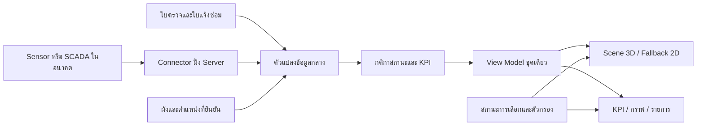

# ข้อมูลค้นคว้าเพิ่มเติม: Dashboard โรงงาน 3 มิติ สำหรับ AI AGY

วันที่ค้นคว้า: 25 กันยายน 2026 | ผู้จัดทำ: Codex

สถานะ: เอกสารวิจัยและข้อเสนอสำหรับพัฒนาต่อ ยังไม่ได้แก้โค้ดหรือติดตั้งเทคโนโลยีตามข้อเสนอ

เอกสารนี้เสริม `logs/2026-09-25_codex_FACTORY_3D_CONCEPT_FOR_AGY.md` ซึ่งอธิบายงานภาพโรงงานการ์ตูนตามภาพถ่ายของผู้ใช้ ฉบับนี้เน้นความถูกต้องของข้อมูล การออกแบบ Dashboard การเชื่อมระบบ และประสิทธิภาพ พร้อมแหล่งอ้างอิงทางการ

## 1. ข้อเสนอหลักสำหรับโครงการนี้

พัฒนาต่อจาก **Three.js + เว็บเดิม + Node.js API** ที่ AGY กำลังทำ โดยให้ภาพ 3D ช่วยตอบว่า “ปัญหาอยู่ที่ไหน” และให้การ์ด/กราฟ/รายการ 2D ช่วยตอบว่า “ปัญหาคืออะไร และต้องทำอะไรต่อ”

ลำดับที่ควรให้ความสำคัญ:

1. แยกสุขภาพเครื่องจักร ความครบถ้วนของงานตรวจ งานซ่อม และความสดใหม่ของข้อมูล
2. ยืนยันการผูกตำแหน่งเครื่องกับพื้นที่ และทำให้ข้อมูลตำแหน่งในโหมด Server เหมือนกันทุกอุปกรณ์
3. ทำให้เลือกวัตถุ 3D แล้วกราฟ ประวัติ และงานซ่อมเปลี่ยนตามเครื่องเดียวกัน
4. ลดการ render ขณะภาพนิ่งและจัดการ resource เมื่อออกจากหน้า เพื่อใช้งานบน iPad ต่อเนื่องได้
5. เพิ่มข้อมูลจาก sensor หรือระบบโรงงานภายหลัง เมื่อมีแหล่งข้อมูลจริงและกติกาประเมินที่ตกลงกันแล้ว

ข้อเสนอข้างต้นเป็นการประยุกต์ให้เหมาะกับ ESC ไม่ใช่ข้อกำหนดจากผู้ผลิตไลบรารี และไม่ได้หมายความว่าระบบที่กำลังพัฒนาได้ผ่านการทดสอบแล้ว

## 2. สิ่งที่พบจากระบบตัวอย่างและเอกสารทางการ

| สิ่งที่ค้นพบ | หลักฐาน | สิ่งที่นำมาใช้กับ ESC |
| --- | --- | --- |
| 3D tag เชื่อมค่าข้อมูลและการเลือก tag ไปยัง panel อื่นได้ | [Grafana: TwinMaker panels](https://grafana.com/docs/plugins/grafana-iot-twinmaker-app/latest/panels/) | ใช้ selection state กลาง ให้แผนที่ กราฟ และใบงานอ้างเครื่องเดียวกัน |
| Scene ประกอบด้วย node, model, camera, annotation และ data binding ที่แยกจัดการได้ | [AWS: Dynamic scenes](https://docs.aws.amazon.com/iot-twinmaker/latest/guide/dynamic-scenes.html) | แยก scene layout ออกจากข้อมูลเครื่องและผลตรวจ ไม่ผูกทุกอย่างกับ mesh |
| ภาพที่ไม่เคลื่อนไหวสามารถ render เฉพาะเมื่อเปลี่ยนข้อมูลหรือกล้อง | [Three.js: Rendering on Demand](https://threejs.org/manual/pages/rendering-on-demand.html) | โหมดประหยัดพลังงานสำหรับ iPad และจอ Dashboard |
| วัตถุจำนวนมากที่ใช้ geometry/material เหมือนกันลด draw calls ได้ด้วย instancing | [Three.js: InstancedMesh](https://threejs.org/docs/pages/InstancedMesh.html) | ใช้กับต้นไม้ เสาไฟ และชิ้นส่วนซ้ำ |
| ทรัพยากรกราฟิกต้องมีวงจรคืนหน่วยความจำชัดเจน | [Three.js: Cleanup](https://threejs.org/manual/pages/cleanup.html) | ออกจากแท็บแล้วคืน resource ไม่สร้าง scene ค้างซ้ำ |
| glTF เป็นรูปแบบสำหรับส่งและโหลด asset 3D ระหว่างเครื่องมือและ runtime | [Khronos: glTF](https://www.khronos.org/gltf/) | ใช้ GLB/glTF เมื่อต้องเพิ่มโมเดลอาคารหรือเครื่องจากเครื่องมือสร้างโมเดล |
| ค่าจากระบบอุตสาหกรรมมีทั้ง value, status และเวลาแหล่งกำเนิด/เวลาฝั่ง server | [OPC Foundation: DataValue](https://reference.opcfoundation.org/specs/OPC-10000-4/7.11) | เพิ่มคุณภาพข้อมูลและ timestamp ไม่แสดงเพียงตัวเลขกับสี |

AWS/Grafana ในที่นี้เป็นตัวอย่างแนวทางออกแบบ ไม่ใช่คำสั่งให้ย้ายระบบไปใช้บริการ Cloud และไม่ได้สรุปค่าใช้จ่ายหรือความพร้อมใช้งานของบริการเหล่านั้น

## 3. บริบทโค้ดที่มีอยู่ ณ เวลาค้นคว้า

พบไฟล์ใหม่ที่ AGY กำลังพัฒนาแล้ว:

- `public/js/factory-map-config.js`: สี โซน มุมกล้อง และตำแหน่งเครื่องจักรเริ่มต้น
- `public/js/factory-3d-scene.js`: คลาส `Factory3DScene`, กล้อง, การเลือกโซน, animation, fallback SVG และ `dispose()`
- `public/js/factory-overview.js`: การผูกตำแหน่ง การกรอง การสรุปสถานะ และแผงรายละเอียด
- `public/css/factory-overview.css`: สไตล์หน้า 3D
- `public/assets/factory/three.r128.min.js`: ไฟล์ Three.js ที่ชื่อระบุ r128 พร้อมไฟล์ license
- `public/assets/factory/esc-aerial-reference.jpg` และ `esc-ui-reference.png`: ภาพอ้างอิงที่ถูกเก็บในโครงการแล้ว

เป็นการอ่าน snapshot ระหว่าง AGY ถือครองล็อก v2.1.0 จึงต้องอ่านล่าสุดอีกครั้งก่อนแก้ไข ไม่มีการทดสอบ runtime ในงานค้นคว้านี้

### จุดที่ควรตรวจและปรับก่อนเพิ่มลูกเล่น

| จุดในโค้ดที่อ่าน | ความหมาย/ความเสี่ยงต่อการอ่าน Dashboard | ข้อเสนอ |
| --- | --- | --- |
| `buildEnrichedMachines()` ใช้ `latestDateInDb` แทนวันนี้เมื่อไม่มีใบตรวจวันนี้ | ข้อมูลเก่าอาจถูกนับเหมือนตรวจวันนี้ | แยกวันจริงกับวันสาธิต/วันที่เลือกอย่างเปิดเผย |
| `computedStatus` มี `PENDING`, `OK`, `DEFECT` และตรวจวันนี้แล้วเป็น `OK` ถ้าไม่เข้าเงื่อนไข defect | ผล warning อาจไม่แสดงเป็นสุขภาพเฝ้าระวัง | แยก `health` ออกจาก `inspectionState` |
| `hasDefect` รวมงานซ่อมค้างและผลผิดปกติในวันเดียวกัน | ผู้ใช้แยกไม่ได้ว่าสีแดงมาจากค่าปัจจุบันหรือใบงานเก่า | แสดงเหตุผลและตัวเลขแต่ละประเภท |
| `getMachinePlacementsMap()` / `saveMachinePlacementsMap()` ใช้ LocalStorage | การผูกพื้นที่ที่แก้ในเครื่องหนึ่งไม่ได้เป็นข้อมูลกลางโดยวิธีนี้ | โหมด Server เก็บ mapping ผ่าน API; โหมด Standalone ระบุขอบเขตเครื่องนี้ |
| default placements หลายเครื่องมีโซนแล้ว แต่ `locationVerified: false` | อาจตีความตำแหน่งประมาณเป็นตำแหน่งจริง | ใช้เส้นประ/ป้าย “ตำแหน่งประมาณ” และตัวกรองเฉพาะที่ยืนยัน |
| คำอธิบายโซนระบุหน้าที่อาคาร/บ่อจากภาพ | ภาพภายนอกไม่ได้ยืนยันหน้าที่เหล่านั้น | เก็บ `nameVerified`/หลักฐาน หรือใช้ชื่อกลางก่อน |
| `_animate()` วน render ต่อเนื่องและอัปเดตป้ายทุกเฟรม | มีต้นทุนแม้ไม่ได้โต้ตอบ โดยเฉพาะ iPad | เพิ่ม dirty flag และหยุด loop เมื่อภาพนิ่ง |
| เส้นสายตรวจใช้ `CatmullRomCurve3` เชื่อมศูนย์กลางโซน | เส้นอาจผ่านอาคารหรือบ่อ จึงไม่ใช่ทางเดินจริง | ระบุว่าเป็นลำดับจุดตรวจ; ใช้โครงข่ายทางเดินที่ยืนยันเมื่อทำการนำทาง |

ข้อสังเกตเหล่านี้เป็นข้อเสนอให้ตรวจซ้ำจาก snapshot ไม่ใช่การตัดสินคุณภาพของงาน AGY ที่ยังเขียนไม่เสร็จ

## 4. รูปแบบ Dashboard ที่ใช้งานได้จริง

### 4.1 หน้าภาพรวมสำหรับหัวหน้างาน

- ด้านบน: ตัวกรองโรงงาน/พื้นที่/แผนก/วันหรือกะ และเวลาอัปเดตข้อมูล
- KPI 4–6 รายการ: เครื่องผิดปกติ, เครื่องเฝ้าระวัง, งานตรวจเลยกำหนด, งานซ่อมค้าง, ข้อมูลเก่า/ขาด, ตำแหน่งยังไม่ยืนยัน
- กลางหน้า: โมเดลโรงงานสไตล์การ์ตูนจากคอนเซ็ปต์เดิม เน้นอาคารขาว ทางเข้าด้านหน้า อาคารแดง ลานกลางและบ่อขวา
- แถบด้านขวา: “รายการที่ต้องจัดการ” เรียงตามความรุนแรงและอายุรายการ คลิกแล้วเลือกเครื่องในฉาก
- รายละเอียดเครื่อง: กราฟค่าล่าสุด, วันเวลาวัด, ผู้ตรวจ/แหล่งข้อมูล, งานซ่อมค้าง, ปุ่มเริ่มตรวจ/ดูใบงาน

### 4.2 สลับชั้นข้อมูลโดยไม่เปลี่ยนความหมายสี

| ชั้นข้อมูล | สิ่งที่สีบนฉากแทน | ข้อมูลเสริม |
| --- | --- | --- |
| สุขภาพเครื่อง | normal / warning / abnormal / unknown | อายุข้อมูลและงานซ่อมเป็น badge แยก |
| งานตรวจตามแผน | due / in_progress / completed / overdue / not_scheduled | รอบตรวจและวันปฏิบัติงาน |
| งานซ่อม | จำนวนใบงานที่ยังเปิด แยกความรุนแรง | รออะไหล่/กำลังซ่อม/ผู้รับผิดชอบ |
| ความครบถ้วนของข้อมูล | fresh / stale / missing / bad | ชื่อแหล่งข้อมูลและเวลาที่ได้รับล่าสุด |
| สายเดินตรวจ | ลำดับจุดและความคืบหน้า | เส้นทางเป็นแบบ schematic หรือยืนยันแล้ว |

บนหน้าจอแสดง legend เฉพาะชั้นที่เลือก และต้องเปลี่ยนชื่อหัวแผนที่ด้วย ไม่ปล่อยให้สีเหลืองหมายถึงทั้ง “ยังไม่ตรวจ” และ “เฝ้าระวัง” โดยไม่มีคำอธิบาย

### 4.3 ทำให้เลือกแล้วข้อมูลเชื่อมกัน

ใช้ state กลาง เช่น `selectedAssetId`, `selectedZoneId`, `activeLayer`, `timeRange`, `selectedRoundId`, `dataMode` การคลิก marker, ผลค้นหา หรือรายการงานซ่อมต้องเรียก flow เลือกเครื่องเดียวกัน

ลำดับแนะนำ: เลือกเครื่อง → ตรวจว่ามีตำแหน่งหรือไม่ → ขยับกล้องถ้ามี → เปิด drawer → โหลดประวัติ/กราฟเฉพาะเครื่อง → รักษาตัวกรองเดิมเมื่อปิด drawer

แนวคิดนี้ประยุกต์จากการให้ tag ใน Scene Viewer เปลี่ยนตัวแปรที่ panel อื่นใช้งาน ไม่จำเป็นต้องติดตั้ง Grafana เพื่อทำพฤติกรรมเดียวกันในแอปเดิม [Grafana: Scene Viewer](https://grafana.com/docs/plugins/grafana-iot-twinmaker-app/latest/panels/)

## 5. นิยามสถานะให้ชัดก่อนเขียนสี

เสนอให้มีอย่างน้อย 5 มิติแยกกัน:

```text
health           = normal | warning | abnormal | unknown
inspectionState  = not_scheduled | due | in_progress | completed | overdue
operatingState   = running | standby | maintenance | unknown
dataQuality      = good | uncertain | bad | missing
freshness        = fresh | stale | unknown
```

`openDefectCount`, `highestOpenDefectSeverity` และ `locationVerified` เป็นข้อมูลแยก ห้ามใช้การรับทราบใบงานเป็นเหตุให้สุขภาพเครื่องกลับปกติเอง

### กติกาตัวอย่างสำหรับ ESC

1. งานตรวจ “ครบ” ต้องอ้างงานที่ถึงกำหนดจริงและรายการบังคับที่ครบ ไม่ใช่มี inspection ใด ๆ ของเครื่องในวันนี้ก็ถือว่าครบทุกงาน
2. ใบบันทึกฉุกเฉินที่วัด 1 จุดอัปเดตข้อมูลจุดนั้นได้ แต่ไม่ทำให้ฟอร์มรายวันครบทั้งใบ
3. ผล warning ต้องยังเป็น warning แม้ช่างตรวจครบแล้ว
4. การหยุดสำรองไม่ได้แปลว่าผิดปกติ และการยังไม่ตรวจไม่ได้แปลว่าปกติ
5. ถ้ามีใบงานค้างจากอดีต แต่ผลล่าสุดปกติ ให้แสดงทั้งสองข้อเท็จจริงพร้อมกัน
6. ค่าที่อ่านไม่ได้ห้ามแทนด้วย 0; ใช้ null และแสดง “ไม่มีข้อมูล”
7. โซนไม่มีเครื่องที่ผ่านตัวกรองแสดง “ไม่มีรายการในตัวกรองนี้” ไม่ใช่ 100% ปกติ
8. โซนที่มีค่าปกติ 8 เครื่องและไม่มีข้อมูล 2 เครื่อง แสดงสองจำนวนแยก ไม่ระบายเขียวให้สื่อว่าครบทั้ง 10
9. หากมีหลายแหล่ง เช่น sensor กับ manual inspection ให้กำหนด source priority ต่อ metric และแสดงที่มา ไม่เลือกค่าจากตัวเลขที่สูงที่สุดโดยพลการ
10. ระดับสุขภาพรวมของเครื่องจากการตรวจบางส่วนต้องมี coverage; ผลปกติจากจุดเดียวไม่ล้างความผิดปกติของจุดอื่นที่ยังไม่ตรวจซ้ำ

### กะและเวลา

เก็บเวลาที่ใช้แลกเปลี่ยนข้อมูลเป็น ISO 8601 พร้อม timezone/UTC และแสดงผลด้วย `Asia/Bangkok` วันปฏิบัติงานอาจไม่ตรงกับวันที่ปฏิทิน เช่น กะ 20:00–08:00 ต้องกำหนดชัดว่ารอบนั้นผูกกับวันเริ่มกะ คำนวณในชั้นกติกากลางที่ test ได้

แยก `observedAt` (เวลาตรวจ/วัด), `receivedAt` (เวลาระบบได้รับ), `snapshotAt` (เวลาสร้างชุดข้อมูลให้หน้าเว็บ) และ `lastSuccessfulFetchAt` (เวลาหน้าเว็บโหลดสำเร็จ) การกดรีเฟรชไม่เปลี่ยนเวลาวัด

OPC UA แยก SourceTimestamp และ ServerTimestamp เช่นกัน แต่ SourceTimestamp อาจสะท้อนการเปลี่ยนค่าหรือสถานะ จึงอย่าตัดสินว่า sensor offline จากเวลานี้เพียงตัวเดียว ต้องรู้พฤติกรรมการส่งค่าคงที่และ heartbeat ของ connector ก่อน [OPC Foundation: DataValue](https://reference.opcfoundation.org/specs/OPC-10000-4/7.11)

## 6. KPI ที่คำนวณได้จากข้อมูลของระบบ

นิยามด้านล่างเป็นข้อเสนอการวัดของโครงการ ไม่ใช่มาตรฐานโรงงานที่ใช้ได้โดยไม่ปรับบริบท

| KPI | นิยามที่เสนอ | ข้อมูลจำเป็น |
| --- | --- | --- |
| เครื่องผิดปกติ | นับ asset ไม่ซ้ำที่ health = abnormal ภายใน scope ปัจจุบัน | สถานะที่มีแหล่งอ้างอิง |
| ความครบถ้วนงานตรวจ | จำนวน scheduled task ที่เสร็จ / จำนวน scheduled task ที่ถึงกำหนด × 100 | taskId, formVersion, roundId, dueAt, completion |
| งานตรวจเลยกำหนด | งานที่ dueAt ผ่านแล้วและยังไม่เสร็จ โดยแยกงานยกเลิก/ยกเว้น | กำหนดเวลาและสถานะรอบ |
| งานซ่อมค้าง | ticket ที่สถานะยังไม่ resolved/closed แยกตาม severity | ใบงานและสถานะล่าสุด |
| อายุงานซ่อม | เวลาปัจจุบันลบเวลาเปิดใบงานสำหรับใบงานค้าง | createdAt ที่ parse ได้แน่นอน |
| ความพร้อมของข้อมูล | จำนวน asset ที่มีชุด metric จำเป็นครบและ fresh / จำนวน asset ที่ต้องติดตาม | required metrics, freshness policy |
| ความครบถ้วนตำแหน่ง | เครื่องที่มี mapping ยืนยันแล้ว / เครื่องที่ต้องแสดงบนผัง | placement + verification |

เมื่อไม่มี denominator ให้แสดง “ยังไม่มีแผน/ไม่สามารถคำนวณ” แทน 0% หรือ 100% ทุก KPI ต้องมีช่วงเวลา หน่วย และ scope ของตัวกรอง

ยังไม่ควรแสดง OEE, MTBF, MTTR หรือพลังงานต่อหน่วยการผลิตจากข้อมูลตรวจเช็คอย่างเดียว ต้องมีข้อมูลการผลิต เหตุขัดข้อง ช่วง downtime และกติกานับที่เหมาะสมก่อน

## 7. แยกชั้นข้อมูลออกจากงานวาด



Renderer รับข้อมูลที่สรุปแล้ว เช่นสี ป้าย ตำแหน่ง และ selection ไม่อ่าน SQL ไม่ตัดสินเกณฑ์เครื่องจักร และไม่สร้างใบแจ้งซ่อมใน animation loop แนวคิดการแยก model, entity และ binding มีตัวอย่างใน [AWS: Dynamic scenes](https://docs.aws.amazon.com/iot-twinmaker/latest/guide/dynamic-scenes.html) ส่วนการแบ่งชั้นข้างต้นเป็นข้อเสนอสำหรับ ESC

### ตัวอย่าง View Model

เป็นข้อมูลตัวอย่างเพื่ออธิบาย schema ไม่ใช่ผลตรวจจริงหรือพิกัดยืนยัน:

```json
{
  "schemaVersion": 1,
  "snapshotAt": "2026-09-25T10:00:00Z",
  "dataMode": "server",
  "asset": {
    "id": "asset-example-001",
    "machineCode": "MCH-BLR-P01",
    "zoneId": null,
    "locationVerified": false,
    "health": "warning",
    "healthReason": "bearing_de_temperature_above_normal",
    "coverage": "partial",
    "inspectionState": "in_progress",
    "operatingState": "running",
    "openDefectCount": 1,
    "metrics": [
      {
        "key": "bearing_de_temperature",
        "value": 74.2,
        "unit": "degC",
        "sourceType": "manual_inspection",
        "sourceId": "inspection-example-001",
        "observedAt": "2026-09-25T09:50:00Z",
        "receivedAt": "2026-09-25T09:51:00Z",
        "quality": "good",
        "freshness": "fresh",
        "thresholdProfileId": "bearing-example-v1"
      }
    ]
  }
}
```

เกณฑ์ 74.2 ในตัวอย่างไม่ได้หมายความว่าอุณหภูมินี้เป็น warning สำหรับทุกเครื่อง ต้องใช้ threshold profile ของเครื่อง/จุดตรวจที่ได้รับการกำหนดแล้ว และเก็บ version ของเกณฑ์ไว้กับผลการประเมิน

### ข้อมูลขั้นต่ำที่ควรมีเมื่อขยายฐานข้อมูล

- `asset_placements`: assetId, zoneId, position, layoutVersion, verifiedBy, verifiedAt, revision
- `metric_definitions`: metricKey, unit, required, sourcePriority, freshnessPolicy, thresholdProfileId
- `measurements`: assetId, metricKey, value, observedAt, receivedAt, quality, sourceId
- `inspection_tasks`: taskId, roundId, assetId, formVersion, dueAt, completedAt, status
- `layout_versions`: layoutVersion, coordinateSystem, sourceReference, publishedAt

นี่เป็น schema เชิงแนวคิด AGY ต้องเทียบกับตาราง routes/rounds/inspections ที่มีอยู่และเลือกเพิ่มเท่าที่จำเป็น ไม่สร้างข้อมูลซ้ำสองแหล่งโดยไม่มีเจ้าของข้อมูลชัดเจน

## 8. วิธีอัปเดตข้อมูล: เริ่มง่ายและขยายได้

| ทางเลือก | ใช้เมื่อใด | ข้อเสนอสำหรับโครงการ |
| --- | --- | --- |
| โหลดครั้งแรก + ปุ่มรีเฟรช | งานตรวจคนกรอก ข้อมูลเปลี่ยนไม่ถี่ | ขั้นเริ่มต้นที่ตรวจสอบได้ง่าย |
| Polling แบบไม่ซ้อนคำขอ | ต้องอัปเดตหลายจอเป็นระยะ | เริ่มช่วง 15–30 วินาทีเป็นค่าทดลอง ปรับตามโหลดจริง |
| SSE + REST | Server ส่งสถานะใหม่ให้ browser ส่วนบันทึกใช้ API ปกติ | พิจารณาเมื่อมีผู้ใช้หลายจอและต้องการแจ้งการเปลี่ยนทันที |
| WebSocket | ต้องแลก event สองทางถี่และมี requirement ชัด | ยังไม่จำเป็นสำหรับการแสดงผลอย่างเดียว |

SSE เป็นทางส่งข้อมูลจาก server ไป client ผ่าน EventSource และมีการเชื่อมใหม่ตามพฤติกรรมของ API; รูปแบบ stream ใช้ `text/event-stream` ต้องคำนึงถึงจำนวน connection โดยเฉพาะหลายแท็บผ่าน HTTP/1.1 [MDN: Using server-sent events](https://developer.mozilla.org/en-US/docs/Web/API/Server-sent_events/Using_server-sent_events)

ข้อเสนอ implementation ของ ESC:

- สร้าง service อัปเดตข้อมูลหนึ่งตัวต่อหน้าแอป แล้วแจกข้อมูลให้ scene/panel ไม่เปิด connection ต่อ marker
- ถ้า polling ให้รอคำขอเดิมจบก่อนเริ่มรอบใหม่ มี timeout, cancellation และ backoff เมื่อผิดพลาด
- หากเพิ่ม SSE ให้ event มี ID/revision; reconnect ต้องโหลด snapshot หรือขอข้อมูลส่วนที่ขาด ห้ามเชื่อว่าทุก event ส่งถึงเสมอ
- ตัวอย่าง event envelope: `{ "eventId": "evt-101", "assetId": "asset-001", "revision": 8, "type": "asset.updated" }`; จะส่ง delta หรือให้ fetch ใหม่เลือกอย่างเดียวให้ชัด
- เปรียบเทียบ revision และ schemaVersion ก่อนรับข้อมูลที่ช้ากว่า; revision ของ transport ไม่แทน observedAt ของการวัด
- คำขอกราฟเครื่อง A ที่กลับมาหลังผู้ใช้เลือก B ต้องถูกยกเลิกหรือถูกทิ้ง ไม่อัปเดต drawer ผิดเครื่อง
- snapshot แสดงผลไม่ควรส่งรูปถ่ายและลายเซ็นทั้งหมดทุก 15 วินาที โหลดรายละเอียดเมื่อเปิดใบงาน
- โหมด `file://` ใช้ข้อมูลในอุปกรณ์นั้น ไม่มี SSE ไปยังฐานข้อมูลกลางโดยอัตโนมัติ
- เมื่อ Server ติดต่อไม่ได้ให้แสดงชุดข้อมูลที่โหลดสำเร็จล่าสุดพร้อมป้ายเวลาและสถานะ ไม่เปลี่ยนเป็น demo แบบเงียบ ๆ
- connector sensor ทำงานฝั่ง Server; หน้า Dashboard นี้มีหน้าที่แสดงผลและเข้าถึง workflow ตรวจเช็ค ไม่เพิ่มคำสั่งควบคุม PLC จากการคลิกโมเดล

## 9. ประสิทธิภาพที่ควรเพิ่มให้หน้า 3D

### 9.1 Render เฉพาะเมื่อจำเป็น

เอกสาร Three.js แนะนำให้ฉากที่ไม่ต้องเคลื่อนไหว render เมื่อมีการเปลี่ยนกล้อง ข้อมูล หรือ asset พร้อมใช้ แทนการวาดต่อเนื่องตลอดเวลา [Three.js: Rendering on Demand](https://threejs.org/manual/pages/rendering-on-demand.html)

ข้อเสนอ: `invalidate(reason)` ตั้ง dirty flag; scheduler ขอได้ไม่เกินหนึ่ง frame ที่ค้างอยู่ วาดต่อเฉพาะช่วงกล้องยังเคลื่อนหรือเปิด animation เมื่อกล้องนิ่งและข้อมูลไม่เปลี่ยนให้หยุด เอฟเฟกต์ควันในฉากปัจจุบันควรมีปุ่มปิด และปิดในโหมดประหยัดพลังงาน

ใช้ `visibilitychange` หยุดงานเมื่อเอกสารถูกซ่อน และตรวจด้วยว่าหน้า 3D เป็น active tab ของแอปหรือไม่ เพราะสลับแท็บภายใน SPA ไม่ได้ทำให้ document hidden เสมอ [MDN: Page Visibility API](https://developer.mozilla.org/en-US/docs/Web/API/Page_Visibility_API)

### 9.2 ลดงานวาดและการเขียน DOM

- ใช้ InstancedMesh สำหรับต้นไม้/เสาที่ geometry และ material ใช้ร่วมกันได้ แต่เก็บ instance-to-asset mapping หากชิ้นนั้นต้องถูกเลือก [Three.js: InstancedMesh](https://threejs.org/docs/pages/InstancedMesh.html)
- อัปเดตตำแหน่ง HTML label เมื่อกล้อง/ขนาดจอ/พิกัดเปลี่ยน อัปเดตข้อความเมื่อข้อมูลเปลี่ยน ไม่เขียน innerHTML ทุกเฟรม
- สร้างดัชนี `Map` ของ inspections และ defects ต่อ asset ก่อนสรุปแต่ละเครื่อง แทน filter ทั้งชุดซ้ำต่อเครื่องทุกครั้ง
- เปลี่ยนสี/material state ของวัตถุที่เปลี่ยนจริง ไม่สร้างโรงงานใหม่ทั้งฉากเมื่อเปลี่ยนตัวกรอง
- ลดต้นทุนพื้นผิวโปร่งใสและเงาหลายชั้น; กำหนดขนาด drawing buffer ตามระดับคุณภาพ ไม่ตาม devicePixelRatio เต็มทุกเครื่อง [Three.js: Responsive Design](https://threejs.org/manual/pages/responsive.html)

### 9.3 งบประสิทธิภาพเริ่มต้น

ตัวเลขต่อไปนี้เป็นเป้าหมายทดลองของโครงการ ไม่ใช่ข้อจำกัด Three.js หรือผลวัดที่ยืนยันแล้ว:

| รายการ | เป้าหมายเริ่มต้น |
| --- | --- |
| iPad โหมดทั่วไป | 30 fps ระหว่างหมุน/เลื่อน |
| Desktop | 60 fps เมื่ออุปกรณ์รองรับ |
| ภาพนิ่งโหมดประหยัด | ไม่มี render loop ต่อเนื่องเมื่อไม่มีข้อมูล/กล้องเปลี่ยน |
| Pixel ratio | เริ่ม 1–1.5 บน tablet; เพิ่มได้เมื่อวัดแล้วไหว |
| Draw calls ของฉาก overview | ทดลองให้อยู่ประมาณไม่เกิน 150 แล้ววัดก่อนปรับรายละเอียด |
| Triangles ใน overview | เริ่มประมาณไม่เกิน 150,000 โดยเงาและวัสดุมีผลด้วย |
| ป้ายบนฉาก overview | 8–12 ป้ายที่อ่านได้; จุดย่อยแสดงเมื่อเลือกโซน |
| Asset ฉากแรก | มุ่งไม่เกิน 5 MB ไม่รวมข้อมูลใบตรวจทั้งหมด |

วัดรุ่นอุปกรณ์ OS browser ขนาด viewport ข้อมูลทดสอบ เวลาโหลด และ frame time ด้วย ไม่รายงานว่า “รองรับ iPad” จากการย่อหน้าต่างบน desktop อย่างเดียว `renderer.info` ช่วยตรวจสถิติ render/resource ได้ โดยต้องตรวจ API ให้ตรงรุ่นที่ใช้อยู่ [Three.js: WebGLRenderer](https://threejs.org/docs/pages/WebGLRenderer.html)

### 9.4 Cleanup และการกู้ฉาก

ต้องคืน geometry, material, texture และ render target ที่ scene เป็นเจ้าของ รวมทั้งยกเลิก timer/RAF/listener/observer ไม่ dispose resource ที่อีก scene ยังใช้ร่วมอยู่; ใช้ registry/ref count หรือขอบเขต ownership ชัดเจน [Three.js: Cleanup](https://threejs.org/manual/pages/cleanup.html)

รองรับกรณี context สูญหายและการเปิดใหม่ โดยให้ผู้ใช้ยังเข้าถึงข้อมูลผ่าน 2D/list ได้ การมี WebGL เมื่อเริ่มต้นไม่รับประกันว่าจะคงอยู่ตลอด session [MDN: isContextLost](https://developer.mozilla.org/en-US/docs/Web/API/WebGLRenderingContext/isContextLost)

## 10. โมเดล 3D และข้อจำกัดเวอร์ชัน

### ระยะเริ่มต้น: Procedural geometry

เหมาะกับฉากการ์ตูนที่กำลังสร้าง: ปรับขนาดหลังคา อาคาร ถนน และบ่อจาก config ได้รวดเร็ว ใช้รายละเอียดเป็นลำดับ: silhouette ก่อน → สัดส่วนพื้นที่ → สีและแสง → ป้ายข้อมูล → รายละเอียดเล็ก

### ระยะต่อยอด: Asset จากโปรแกรมสร้างโมเดล

เมื่อมีแบบอาคารที่ยืนยันหรือจำเป็นต้องเพิ่มเครื่องจักรละเอียด ให้ใช้ GLB/glTF เป็นรูปแบบส่งมอบที่เหมาะกับ runtime ส่วนไฟล์ต้นฉบับเก็บสำหรับแก้ไข asset ภายหลัง [Khronos: glTF](https://www.khronos.org/gltf/)

ข้อกำหนด asset ของโครงการ:

- ระบุหน่วย แกนขึ้น จุด origin และ pivot ให้เหมือนกัน
- ตั้งชื่อ node ด้วยรหัสคงที่ เช่น `zone.production-west`, `asset.pump-001`; แยกชื่อแสดงภาษาไทยออกจากรหัส
- ลดชิ้นส่วนเล็กที่มองไม่เห็นในมุมโรงงาน และเตรียมโมเดลหยาบ/ละเอียดตามระดับซูมเมื่อจำเป็น
- ตรวจ license และที่มาของ asset ทุกชิ้น; ไม่ถือว่ารูปจากเว็บใช้เป็นโมเดลเชิงพาณิชย์ได้อัตโนมัติ
- ถ้าใช้ texture/geometry compression ต้องวัดทั้งขนาดไฟล์ เวลา decode และหน่วยความจำบนเครื่องเป้าหมาย และทดสอบ loader/decoder ให้ตรงเวอร์ชัน
- ตรวจอาคาร 3D ด้วยภาพมุมรวม มุมบน และมุมโซนเดียวกันทุกครั้ง เพื่อเทียบรุ่นได้

### ห้ามผสมตัวอย่าง Three.js ต่างรุ่นโดยไม่ตรวจ

พบไฟล์ชื่อ `three.r128.min.js` ในโครงการ แต่เอกสารบนเว็บไซต์เป็นรุ่นปัจจุบัน วิธี import, color management และ API อาจต่างกัน ให้ตรวจ `THREE.REVISION` จริงและบันทึกไว้ก่อนนำตัวอย่างมาใช้

หากคง r128 ให้ใช้ addon/loader ที่ตรงรุ่น หากจะอัปเกรดให้ทำเป็นงานแยกพร้อมทดสอบภาพและโหมดเปิดไฟล์ ไม่เปลี่ยน engine และระบบข้อมูลครั้งใหญ่ใน patch เดียว มี [Three.js Migration Guide](https://github.com/mrdoob/three.js/wiki/Migration-Guide) สำหรับตรวจการเปลี่ยนแปลงระหว่างรุ่น

## 11. การเลือกวัตถุ ป้ายชื่อ และการใช้งาน iPad

ใช้ raycasting กับ hit mesh ที่เรียบง่ายของโซน ไม่จำเป็นต้องยิง ray กับใบไม้หรือรายละเอียดทุกชิ้น หลักการ picking มีอธิบายใน [Three.js: Picking](https://threejs.org/manual/pages/picking.html)

ข้อเสนอ UX:

- click/tap เลือก, drag หมุน, pinch ซูม และมีปุ่มสำหรับ pan/zoom/reset เป็นทางเลือก
- จัดการ `pointercancel` และการยกนิ้วออกนอก canvas ป้องกันสถานะลากค้าง
- label ที่อยู่หลังกล้องหรือถูกบังควรถูกซ่อน/ลดความเด่น โดยยังหาเครื่องจากรายการได้
- เมื่อเลือกเครื่อง ให้มีป้ายเดียวที่เด่นขึ้นและ drawer ข้อมูล ไม่แสดง tooltip ขนาดใหญ่ทุกจุด
- ปุ่มเปิด/ปิด drawer ต้องมีชื่อและ focus กลับไปจุดที่เลือก ใช้รายการ HTML เป็นทางเข้าข้อมูลสำหรับคีย์บอร์ดและผู้ที่ใช้ canvas ไม่สะดวก
- ใช้สีร่วมกับ icon และข้อความ เพราะสีอย่างเดียวไม่เพียงพอในการสื่อความหมาย [W3C: Use of Color](https://www.w3.org/WAI/WCAG22/Understanding/use-of-color.html)
- เป้าหมายของโครงการคือปุ่มหลัก 48–56 CSS px เพื่อช่างหน้างาน ตัวเลขนี้เป็นการออกแบบของ ESC; WCAG 2.2 เกณฑ์ขั้นต่ำ 2.5.8 ระบุ 24×24 CSS px พร้อมข้อยกเว้น จึงอย่าเขียนอ้างว่า WCAG บังคับ 56 px [W3C: Target Size Minimum](https://www.w3.org/WAI/WCAG22/Understanding/target-size-minimum.html)

## 12. การจัดการพื้นที่และข้อมูลร่วมกันหลายคน

### โหมด Server

เก็บ layout และ placements ในฐานข้อมูลกลาง ใช้ immutable asset ID เป็นตัวอ้างอิงหลักและใช้ machine code เป็นชื่อค้นหา/แสดงผล เพราะรหัสเครื่องอาจถูกแก้หรือเปลี่ยนในอนาคต ตรวจ FK และรักษา mapping เมื่อเปลี่ยนรหัส

การแก้ placement ส่ง revision เดิมมาด้วย ถ้ามีคนแก้ไปก่อนให้ server ตอบ conflict และให้ผู้ใช้เห็นข้อมูลล่าสุด ไม่เขียนทับโดยไม่รู้ตัว บันทึกว่าใครยืนยันตำแหน่งเมื่อใดและอ้างเอกสาร/การสำรวจใด

### โหมด Standalone

เก็บ local mapping แบบ versioned และระบุ “ตำแหน่งที่บันทึกในอุปกรณ์นี้” หากมี export/import ให้ตรวจ schema และรหัสเครื่องก่อนรวมข้อมูล ไม่ตีความว่า LocalStorage เป็นระบบแชร์ความคืบหน้าข้าม iPad

### การแสดงสายเดินตรวจ

รุ่นแรกใช้เส้นประเชื่อมจุดตรวจและชื่อ “ลำดับการตรวจ” โดยไม่อ้างเป็นทางเดินจริง จุดที่ยังไม่ยืนยันไม่ควรถูกใช้คำนวณระยะทางหรือเวลาเดิน

ถ้าจะนำทางจริง ต้องมี walkway graph ที่กำหนดทางเชื่อม จุดเข้าอาคาร ชั้น ความสูง และข้อจำกัดพื้นที่ พร้อมเวอร์ชันที่ผู้ดูแลยืนยัน การลากเส้นโค้งผ่านกึ่งกลางโซนไม่สามารถทดแทนข้อมูลนี้ได้

## 13. Backlog สำหรับ AGY ตามลำดับ

| ลำดับ | งาน | จุดเริ่มต้นในโค้ดปัจจุบัน | เกณฑ์สำเร็จ |
| --- | --- | --- | --- |
| P0-1 | แยกสถานะและแก้การใช้วันเก่าแทนวันนี้ | `buildEnrichedMachines`, `computeZoneStats` | warning ยังเป็น warning; ไม่มีผลวันนี้ต้องไม่ถูกนับว่าวันนี้ |
| P0-2 | แยก mapping ประมาณ/ยืนยัน และชื่อพื้นที่ที่ยังไม่ยืนยัน | `factory-map-config.js`, drawer | แสดงชัดทุกจุดที่ใช้ตำแหน่งประมาณ |
| P0-3 | mapping กลางในโหมด Server | placement functions + API/DB | สองอุปกรณ์เห็นตำแหน่งชุดเดียวกันหลังโหลดข้อมูล |
| P0-4 | ข้อมูล stale/error และป้องกันสลับ demo เงียบ ๆ | data adapter/API wrapper | ขาดการเชื่อมต่อแล้วชื่อเครื่องและข้อมูลไม่กลายเป็นชุดสาธิต |
| P1-1 | selection state เชื่อมฉากกับกราฟ/ประวัติ/ใบงาน | `factory-overview.js` | เลือกจากส่วนใดก็เห็นรายละเอียดเครื่องเดียวกัน |
| P1-2 | render on demand และ pause/resume | `Factory3DScene._animate` | โหมดภาพนิ่งหยุด loop และกลับมา render ได้เมื่อมีข้อมูล |
| P1-3 | ตรวจ resource lifecycle, resize และ fallback | `dispose`, `resize`, `_mount2DFallback` | เข้าออกซ้ำไม่สะสม resource และเปิด 2D ได้เมื่อ 3D ล้มเหลว |
| P1-4 | KPI ตาม scheduled tasks และกะจริง | routes/rounds/inspections | emergency entry ไม่ทำให้งานตรวจครบผิดพลาด |
| P2-1 | asset pipeline และ LOD/instancing ตามผลวัด | scene/config/assets | ลดงานวาดโดยยังจำรูปร่างโรงงานได้ |
| P2-2 | connector sensor + SSE เมื่อมีแหล่งข้อมูลจริง | Server/data adapter | มี quality, source timestamp และ reconnect ที่ทดสอบแล้ว |
| P2-3 | ย้อนดูสถานะตามเวลา | ประวัติ event/measurement | แสดงค่า ณ เวลาที่เลือกโดยไม่ใช้ข้อมูลอนาคตปะปน |

P0/P1/P2 ในตารางเป็นลำดับทำงานที่เสนอสำหรับเอกสารนี้ ไม่ใช่คำสั่งหยุดงานที่ AGY กำลังทำ และไม่จำเป็นต้องทำ P2 ทั้งหมดก่อนส่งมอบรุ่นแรก

## 14. ชุดทดสอบที่ควรให้ AGY ทำ

| กรณี | ผลที่ควรได้ |
| --- | --- |
| วันนี้ไม่มีใบตรวจ แต่เมื่อวานตรวจครบ | งานวันนี้ยังไม่ครบ; ไม่แทนวันโดยอัตโนมัติ |
| ตรวจครบและมีค่าระดับ warning | งานตรวจ completed แต่สุขภาพ warning |
| ใบฉุกเฉินวัดเพียงหนึ่งรายการ | อัปเดตจุดนั้น พร้อม partial coverage; งานรายวันยังไม่ครบ |
| ผลล่าสุดปกติแต่ใบซ่อมเก่ายังค้าง | แสดงสุขภาพปกติและใบงานค้างแยกกัน |
| ค่า missing/null หรือ quality bad | ไม่แปลงเป็น 0 และไม่ระบายเป็นปกติ |
| sensor ค่าสม่ำเสมอ มี heartbeat แต่ source timestamp ไม่เปลี่ยน | ใช้ freshness policy ของ connector ไม่แจ้ง offline จากเวลาเปลี่ยนค่าอย่างเดียว |
| เปิดกะ 20:00–08:00 ข้ามวัน | งานยังผูกกับรอบ/วันปฏิบัติงานที่กำหนดไว้ |
| แก้ตำแหน่งพร้อมกันสองจอ | revision conflict ถูกแสดง ไม่ทับข้อมูลเงียบ ๆ |
| เครื่องไม่มี mapping หรืออ้างโซนที่ถูกลบ | อยู่รายการ unmapped และยังเปิดข้อมูลได้ |
| เลือก A แล้วเลือก B อย่างรวดเร็ว | ผลโหลด A ไม่เขียนทับ drawer ของ B |
| event ซ้ำ/มาผิดลำดับ/ขาดช่วง | ไม่ rollback state และ resync เมื่อจำเป็น |
| Server ล่มระหว่างเปิด Dashboard | แสดงข้อมูลเดิมพร้อมเวลา/ข้อผิดพลาด ไม่สลับ demo |
| ซ่อน browser แล้วกลับมา | ไม่สะสม timer และ refresh/sync ก่อนแสดงว่าข้อมูลเป็นปัจจุบัน |
| เข้าออกหน้า 3D 20 รอบ | ไม่มี resource/connection เพิ่มสะสมอย่างต่อเนื่องหลัง warm-up |
| context loss หรือ renderer โหลดไม่ได้ | เข้าถึงพื้นที่ เครื่อง และใบงานผ่าน 2D/list ได้ |
| เปลี่ยนจอแนวตั้ง/แนวนอนและเปิด drawer | canvas/picking/label ตรงกัน ปุ่มไม่ถูกบัง |
| โหมดลดการเคลื่อนไหว | ไม่มีควัน/การเคลื่อนไหวตกแต่ง และข้อมูลยังครบ |

ทดสอบ logic สถานะด้วยข้อมูลจำลองที่แยกจากฐานจริง ทดสอบ UI กับข้อมูลชุดเดียวกันทั้ง 3D และ 2D และวัดประสิทธิภาพบนอุปกรณ์เป้าหมายจริง ไม่ใช้ผล syntax check แทนผลทดสอบการทำงาน

## 15. ข้อมูลที่ควรขอจากเจ้าของโรงงานเมื่อถึงขั้นผูกข้อมูลจริง

รายการนี้ไม่ใช่เงื่อนไขหยุดสร้างฉากหรือโครงหน้าเว็บ สามารถทำ P0/P1 ที่ไม่ขึ้นกับข้อมูลเหล่านี้ไปก่อนได้:

- ผังพื้นที่หรือชื่ออาคารที่ยืนยันแล้ว รวมทางเข้าจริงและจุดห้ามผ่าน
- รายการเครื่องจักรกับพื้นที่/อาคาร/ชั้น/จุดติดตั้ง และผู้ยืนยัน mapping
- ตารางกะและรอบตรวจของแต่ละเครื่อง/แบบฟอร์ม รวมกติกาข้ามวัน
- เกณฑ์ประเมินของแต่ละจุดตรวจและเครื่อง ไม่ใช้ threshold ตัวเดียวทั้งโรงงาน
- แหล่งข้อมูลที่จะเชื่อมจริง: ใบตรวจ, SCADA, OPC UA หรือระบบอื่น พร้อมความถี่และหน่วย
- รุ่น iPad/browser ที่ใช้ จำนวนเครื่องที่ต้องแสดง และจำนวนหน้าจอที่เปิดพร้อมกัน

## 16. Prompt พร้อมส่งให้ AGY

> อ่านเอกสารวิจัยนี้คู่กับเอกสารคอนเซ็ปต์ภาพโรงงานเดิม แล้วอ่านโค้ดล่าสุดภายใต้กฎ COLLABORATION_RULES.md และสถานะล็อกปัจจุบัน งานนี้เป็นการต่อยอดหน้า Factory World ที่มีอยู่ ให้คงรูปแบบโรงงานการ์ตูนตามภาพอ้างอิงและใช้ Three.js ที่โครงการเลือกอย่างสอดคล้องกัน ไม่เขียนทั้งระบบใหม่
>
> เริ่มด้วย P0: แยก health, inspectionState, operatingState, dataQuality, freshness และ openDefectCount; แก้การแทนวันนี้ด้วยวันล่าสุดในฐาน; แยกผลตรวจฉุกเฉินบางส่วนออกจากงานตรวจครบ; แสดงตำแหน่งประมาณกับตำแหน่งยืนยัน; เก็บ mapping กลางเมื่อใช้ Server และแสดงสถานะข้อมูลขาด/เก่าอย่างชัดเจน
>
> จากนั้นทำ P1: selection state กลางเชื่อม 3D กับกราฟและใบงานของเครื่องเดียวกัน, render on demand, pause/resume, resource cleanup และ fallback 2D ตรวจ API ให้ตรง THREE.REVISION จริง โดยไม่คัดตัวอย่างรุ่นใหม่มาปะกับ r128 โดยไม่ตรวจ compatibility
>
> ออกแบบ data adapter ให้รองรับ sensor ในอนาคต แต่ไม่สร้างค่าหรือสถานะสดปลอม และไม่จำเป็นต้องติดตั้ง AWS/Grafana/SSE หากยังไม่มี requirement รองรับ ยึด backlog และ test matrix ในเอกสาร ส่งมอบภาพหน้าจอ ผลทดสอบสถานะ ผลทดสอบ iPad/Server/Standalone และรายการข้อจำกัดที่ยังเหลือ อัปเดต CONTEXT และ log หลังทดสอบจริงตามกฎโครงการ

## 17. แหล่งอ้างอิงที่ตรวจอ่าน

ลิงก์เป็นเอกสารของเจ้าของเทคโนโลยี วันที่ตรวจอ่านคือ 25 กันยายน 2026 API บนเว็บอาจเปลี่ยนภายหลัง จึงต้องเทียบกับเวอร์ชันที่ใช้งานจริงเสมอ:

1. [Grafana — AWS IoT TwinMaker panels](https://grafana.com/docs/plugins/grafana-iot-twinmaker-app/latest/panels/): ตัวอย่าง 3D tag และการเชื่อมข้อมูลกับ panel
2. [AWS — Dynamic scenes](https://docs.aws.amazon.com/iot-twinmaker/latest/guide/dynamic-scenes.html): scene node, component และ data binding
3. [Three.js — Rendering on Demand](https://threejs.org/manual/pages/rendering-on-demand.html): render เฉพาะเมื่อจำเป็น
4. [Three.js — InstancedMesh](https://threejs.org/docs/pages/InstancedMesh.html): การวาดวัตถุซ้ำร่วม geometry/material
5. [Three.js — Cleanup](https://threejs.org/manual/pages/cleanup.html): lifecycle ของทรัพยากรกราฟิก
6. [Three.js — Responsive Design](https://threejs.org/manual/pages/responsive.html): canvas และความละเอียดการวาด
7. [Three.js — Picking](https://threejs.org/manual/pages/picking.html): การเลือกวัตถุในฉาก
8. [Three.js — WebGLRenderer](https://threejs.org/docs/pages/WebGLRenderer.html): renderer และข้อมูลสถิติ
9. [Three.js — Migration Guide](https://github.com/mrdoob/three.js/wiki/Migration-Guide): การเปลี่ยน API ระหว่างเวอร์ชัน
10. [Khronos — glTF](https://www.khronos.org/gltf/): รูปแบบส่งมอบ asset 3D
11. [OPC Foundation — DataValue](https://reference.opcfoundation.org/specs/OPC-10000-4/7.11): value, status และเวลาแหล่งข้อมูล
12. [MDN — Using server-sent events](https://developer.mozilla.org/en-US/docs/Web/API/Server-sent_events/Using_server-sent_events): EventSource และ stream
13. [MDN — Page Visibility API](https://developer.mozilla.org/en-US/docs/Web/API/Page_Visibility_API): สถานะการมองเห็นหน้าเว็บ
14. [MDN — isContextLost](https://developer.mozilla.org/en-US/docs/Web/API/WebGLRenderingContext/isContextLost): การสูญเสีย WebGL context
15. [W3C — Use of Color](https://www.w3.org/WAI/WCAG22/Understanding/use-of-color.html): การสื่อสถานะร่วมกับข้อความหรือสัญลักษณ์
16. [W3C — Target Size Minimum](https://www.w3.org/WAI/WCAG22/Understanding/target-size-minimum.html): ขนาดเป้าหมายการกดและข้อยกเว้น

## 18. บันทึกการทำงานของ Codex

- จัดทำตามคำขอให้ค้นข้อมูลเพิ่มเติมและเขียนเป็น Markdown เพื่อส่งต่อให้ AGY
- ใช้หลักฐานสามประเภทแยกกัน: เอกสารทางการ, snapshot ของโค้ดในเครื่อง, และข้อเสนอการประยุกต์สำหรับ ESC
- ระหว่างค้นคว้า `_lock/current.md` ระบุว่า AGY กำลังพัฒนา v2.1.0 จึงสร้างเฉพาะ log/เอกสารฉบับใหม่ ไม่แก้โค้ด ล็อก CONTEXT หรือเอกสารเดิม
- ไม่สั่ง deploy ไม่เชื่อมระบบ sensor จริง และไม่ส่งข้อความไป AGY โดยอัตโนมัติ
- ไฟล์นี้บันทึกบนเครื่องท้องถิ่น สถานะการซิงค์ OneDrive ต้องตรวจแยกต่างหาก
